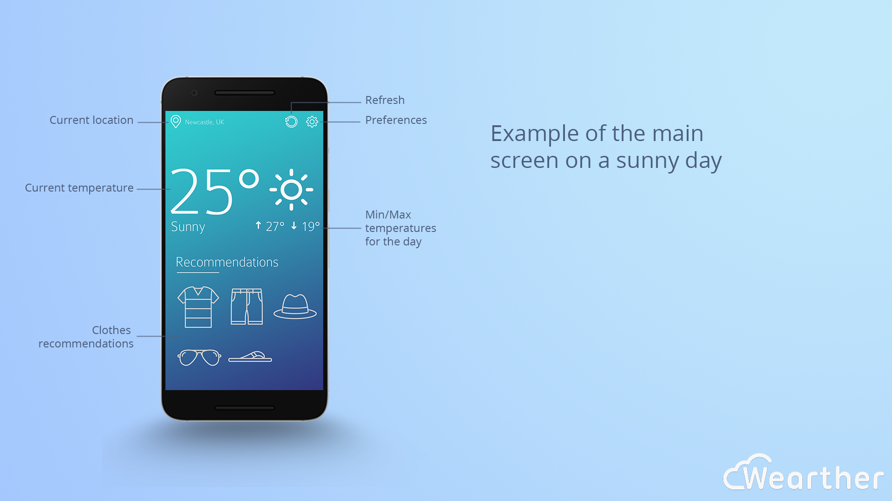
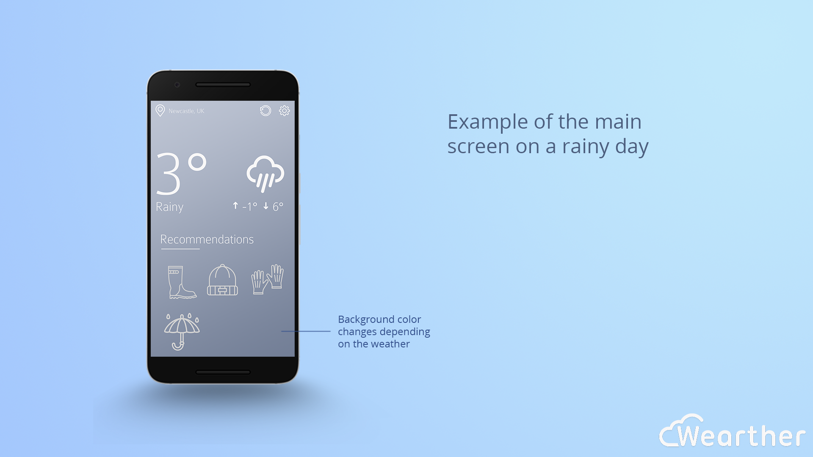
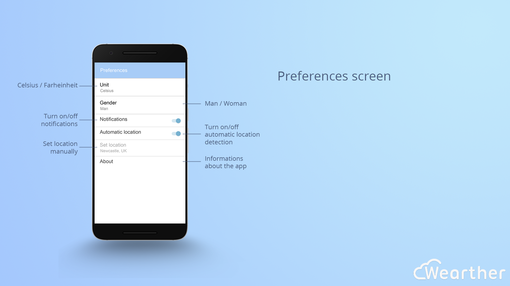
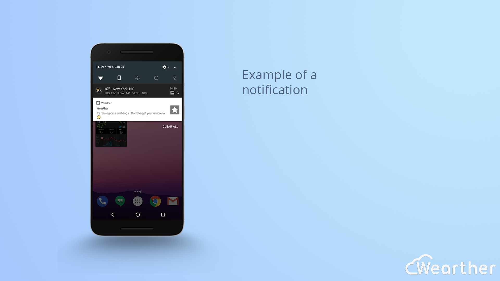
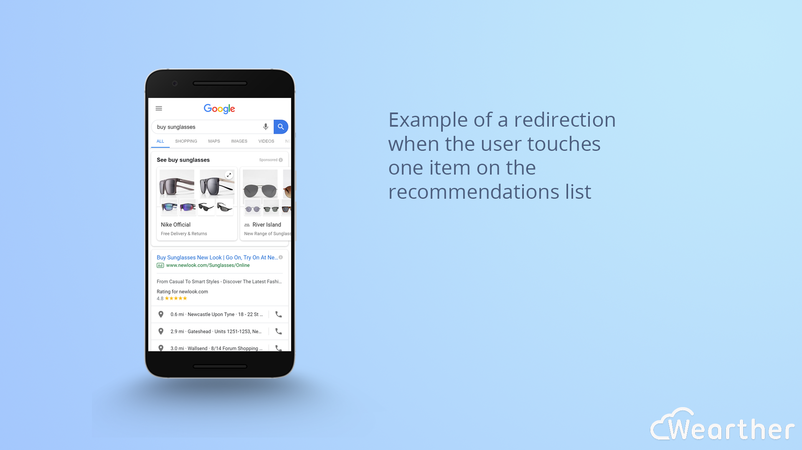

# Wearther

**Wearther** is a weather forecast app that gives outfit suggestions to the user based on the
weather forecast.

## Demo Video

## Context

This app is the result of a school project. The task was to choose an app idea and design it and fully conceive it. We were free to use whatever developpement stack we wanted.

## Storyboard

## Built With

* [Kotlin](https://kotlinlang.org/) - Programming Language
* [Android Studio](https://developer.android.com/studio/) - IDE
* [OpenWeatherMap API](https://openweathermap.org/api) - Weather API

## Authors

* **Taha Yassine** - [Website](https://taha-yassine.github.io/)
